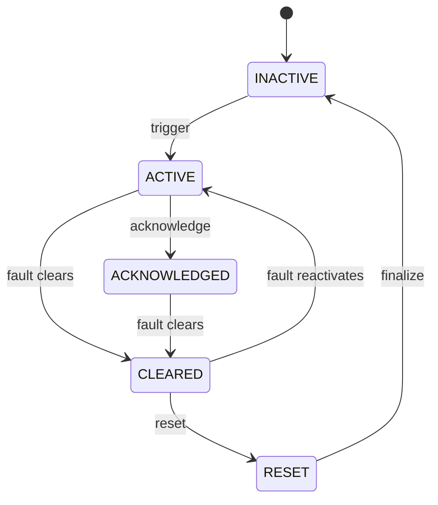
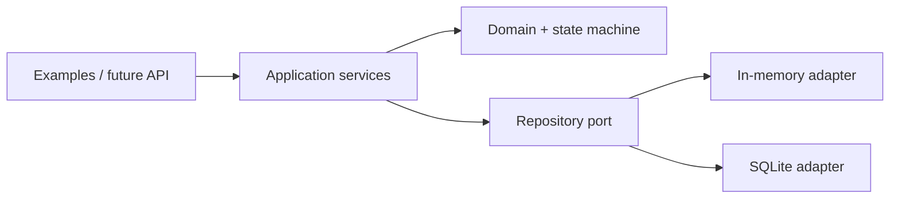

# Industrial Alarm Manager

[](https://github.com/ArungIW2/Industrial-Alarm-Manager/actions/workflows/ci.yml)
[](https://www.python.org/)
[](LICENSE)

A software-only industrial alarm-management engine demonstrating deterministic lifecycle control,
fault handling, acknowledgement, prioritization, append-only history, duplicate detection,
suppression, escalation, and replaceable persistence.

> No PLC, HMI, sensor, motor, physical hardware, or hardware simulation is used. The project
> focuses on control-system software architecture and testable industrial domain logic.

## Engineering Scope

- explicit alarm state machine with invalid-transition guards;
- clear-before-acknowledgement and late-acknowledgement handling;
- duplicate signal detection and cleared-fault reactivation;
- immutable sequence-of-events audit trail with UTC timestamps;
- priority/status/source/time-range queries;
- suppression with actor, reason, expiry, and audit events;
- timeout-based escalation policies;
- repository abstraction with in-memory and SQLite adapters;
- injected clock for deterministic tests;
- static analysis, linting, coverage threshold, and GitHub Actions CI.

## Lifecycle



`ACTIVE → CLEARED` is valid when a condition disappears before acknowledgement. A cleared alarm
may be acknowledged without changing its state; if acknowledgement is configured as required,
reset remains blocked until that acknowledgement exists.

## Quick Start

Requires Python 3.12 or newer.

```bash
git clone https://github.com/ArungIW2/Industrial-Alarm-Manager.git
cd Industrial-Alarm-Manager
python -m venv .venv
python -m pip install -e ".[dev]"
python -m pytest
```

Minimal use:

```python
from industrial_alarm_manager import (
    AlarmDefinition,
    AlarmManager,
    AlarmPriority,
    InMemoryAlarmRepository,
)

repository = InMemoryAlarmRepository()
manager = AlarmManager(repository)

definition = AlarmDefinition(
    code="MOTOR_OVERLOAD",
    name="Motor 01 Overload",
    description="Motor protection detected an overload condition",
    source="MOTOR_01",
    default_priority=AlarmPriority.HIGH,
)
manager.register_definition(definition)

alarm = manager.trigger_alarm("MOTOR_OVERLOAD", "MOTOR_01")
manager.acknowledge_alarm(alarm.occurrence_id, actor="operator-01")
manager.clear_alarm(alarm.occurrence_id)
manager.reset_alarm(alarm.occurrence_id, actor="operator-01")
```

Run the complete example:

```bash
python examples/basic_alarm_flow.py
```

## Architecture



The state machine and domain models do not know that SQLite exists. Persistence adapters cannot
declare an invalid transition valid. This separation keeps lifecycle behavior deterministic and
allows storage or interface technology to change independently.

## Domain Model

| Model | Responsibility |
|---|---|
| `AlarmDefinition` | Configuration, identity, priority, acknowledgement/reset requirements |
| `AlarmOccurrence` | Current lifecycle and counters for one fault occurrence |
| `AlarmEvent` | Immutable audit fact for sequence-of-events analysis |
| `AlarmSuppression` | Auditable temporary/permanent suppression rule |
| `EscalationPolicy` | Unacknowledged timeout and escalation limit by priority |

Definition, occurrence, and event are intentionally separate. An occurrence snapshots its
priority, so historical severity does not change when a definition is reconfigured later.

## Project Structure

```text
src/industrial_alarm_manager/
├── application/          # command and query services
├── domain/               # models, enums, lifecycle state machine
├── storage/              # repository port and adapters
├── clock.py              # injectable time abstraction
└── exceptions.py         # explicit domain failures
tests/
├── unit/
└── integration/
docs/                     # engineering decisions and traceability
examples/                 # executable scenarios
```

## Quality Gate

```bash
python -m ruff check .
python -m mypy src
python -m pytest --cov=industrial_alarm_manager --cov-report=term-missing
```

CI enforces formatting/lint rules, strict type checking, the complete test suite, and at least 85%
branch coverage on Python 3.12.

## Development Roadmap

| Phase | Scope | Status |
|---|---|---|
| 0 | Project foundation | Complete |
| 1 | Domain foundation | Complete |
| 2 | Alarm state machine | Complete |
| 3 | Alarm manager | Complete |
| 4 | Duplicate handling and reactivation | Complete |
| 5 | Repository abstraction and SQLite | Complete |
| 6 | Append-only history and filtering | Complete |
| 7 | Suppression and audit trail | Complete |
| 8 | Timeout-based escalation | Complete |
| 9 | Executable examples and full test suite | Complete |
| 10 | Portfolio documentation and CI | Complete |

## Documentation

- [Requirements traceability](docs/requirements.md)
- [Alarm philosophy](docs/alarm-philosophy.md)
- [Lifecycle rules](docs/alarm-lifecycle.md)
- [Priority definition](docs/priority-definition.md)
- [Architecture](docs/architecture.md)
- [Data model](docs/data-model.md)
- [Testing strategy](docs/testing.md)

## Limitations

This is an educational portfolio implementation, not a certified safety instrumented system or a
drop-in replacement for an ISA-18.2/IEC 62682-compliant production alarm platform. Authentication,
distributed delivery guarantees, external notifications, and PLC/SCADA integration are outside
the current scope.

## License

[MIT](LICENSE)
