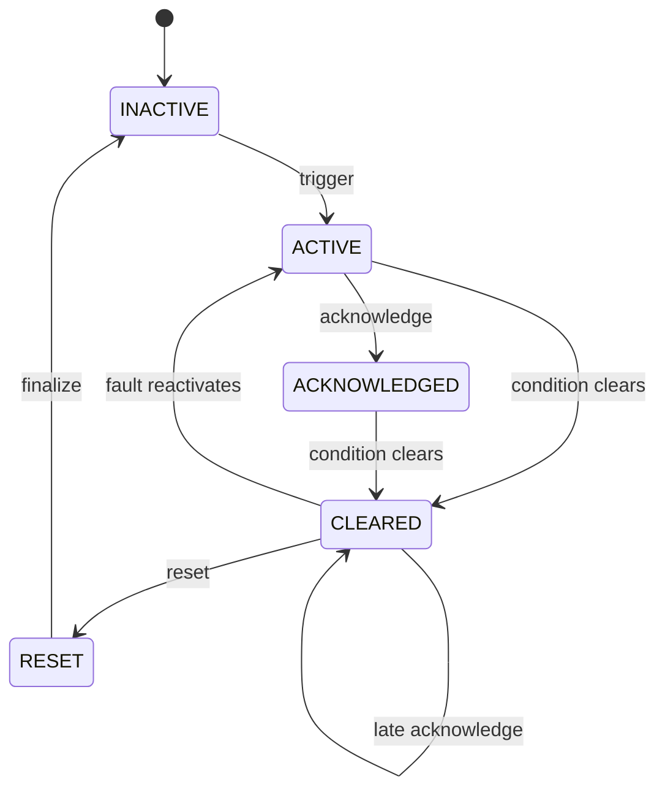

# Alarm Lifecycle

The state machine is explicit and rejects every transition not shown below.

A condition may clear before acknowledgement. If acknowledgement is required, the cleared
occurrence must still be acknowledged before reset. A fault returning from `CLEARED` reuses the
same occurrence and creates `ALARM_REACTIVATED`; a signal repeated while active creates
`DUPLICATE_DETECTED` instead of another occurrence.

