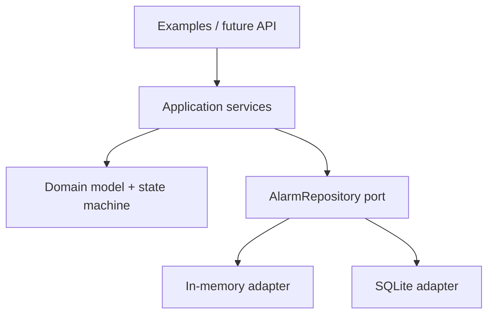

# Architecture

The domain has no dependency on SQLite, CLI, REST, PLC, or HMI technologies. `AlarmManager`
coordinates commands and audit events. `HistoryQueryService` provides the read side, while
`EscalationService` evaluates unacknowledged active alarms using injected policies and a clock.

The repository protocol is the persistence boundary. In-memory storage supports fast unit tests;
SQLite provides a durable adapter without third-party runtime dependencies.

