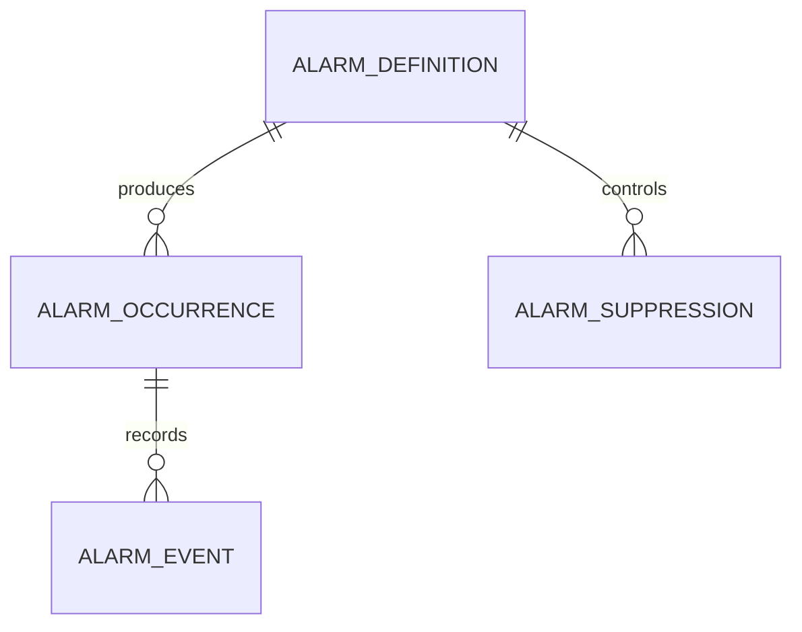

# Data Model

- `AlarmDefinition`: stable configuration, identity, default priority, acknowledgement/reset rules.
- `AlarmOccurrence`: one fault lifecycle with snapshotted priority and counters.
- `AlarmEvent`: immutable sequence-of-events record with state, actor, timestamp, and details.
- `AlarmSuppression`: auditable, expiring rule linked to a definition.
- `EscalationPolicy`: acknowledgement timeout and maximum escalation count by priority.

SQLite stores enum and UUID values as text, timestamps in ISO 8601, and metadata/event details as
JSON. Indexes support identity/state lookup and chronological event queries.

